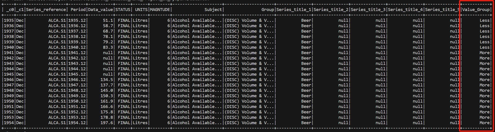

[](https://github.com/nogibjj/IDS706_Fall2023_Mini_Project_10_PySpark/actions/workflows/install.yml)
[](https://github.com/nogibjj/IDS706_Fall2023_Mini_Project_10_PySpark/actions/workflows/lint.yml)
[](https://github.com/nogibjj/IDS706_Fall2023_Mini_Project_10_PySpark/actions/workflows/format.yml)
[](https://github.com/nogibjj/IDS706_Fall2023_Mini_Project_10_PySpark/actions/workflows/test.yml)
# IDS706_Fall2023_Mini_Project_10_PySpark

IDS706 week 10 mini project: Use PySpark to perform data processing on a large dataset.

It contains:

- ``main.py`` contains code that utilizes PySpark to perform data processing tasks on the dataset

- ``data.csv`` a large dataset that contains data describing attributes of different alchohols

- ``.devcontainer`` includes a `Dockerfile` that specifies the configurations of container, and a `devcontainer.json` which is a configuration file used in the context of Visual Studio Code

- ``workflows`` includes `GitHub Actions`, enables automated build, test and deployment for the project

- ``Makefile`` specifies build automation on Linux

- ``requirements.txt`` lists the dependencies, libraries, and specific versions of Python packages required for the project


## How to test

Make sure that you have already installed ``Spark`` in the environment.

First, run 
```bash
make all
```
to install the dependencies and test the whole project. Then run
```bash
python3 ./main.py
```

## Explaination

``main.py`` makes use of ``PySpark`` to perform data processing on the dataset defined by ``data.csv``, which contains data describing attributes of different alcohols.

First, create a ``Spark`` session
```Python
    spark = SparkSession.builder.appName("example").getOrCreate()
```
Then execute a ``Spark`` SQL query. It calculates the average of ``Data_value`` of alcohols whose ``Series_reference`` is ``ALCA.SAABS``.
```Python
    data_value = spark.sql(
        "SELECT AVG(Data_value) AS AvgValue FROM alcohol WHERE Series_reference = 'ALCA.SAABS'"
    )
```
The result shows as below: <br>

<br>
Finally, execute a ``Spark`` data transformation. It groups all data records into two groups: if ``Data_value`` is less than 100, it is grouped into ``Less``; otherwise, it is grouped into ``More``.
```Python
data = data.withColumn(
        "Value_Group", when(data.Data_value < 100, "Less").otherwise("More")
    )
```
The result shows as below:<br>
